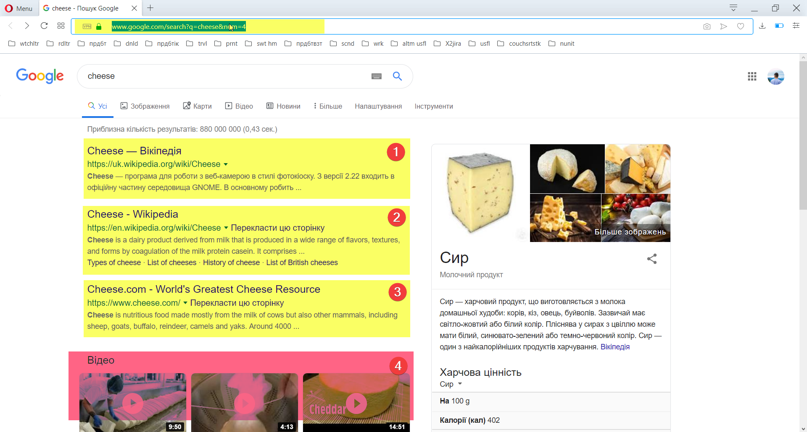
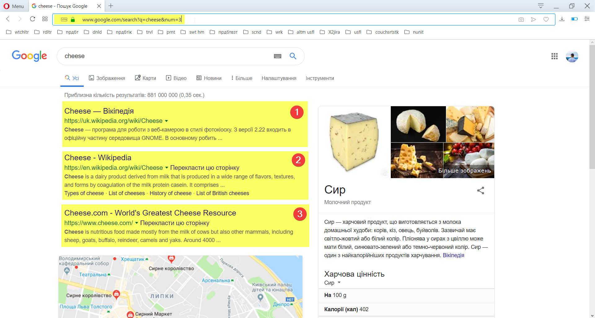

# Google Search Results Test Task
## Yet another test task
Long Stoty Short - sometimes you do a test task to understand something unrelated to task itself and [write a story](https://siniavtsev.io/blog/all/software-quality-assurance-in-ukraine-quick-start-and-deep-swamp/)

## Original Task
### Installation  
1. Install Visual Studio Community - https://visualstudio.microsoft.com/vs/community/  
2. Run Visual Studio and create a new test project.  
3. Install the following NuGet packages:  
· NUnit - https://www.nuget.org/packages/NUnit/  
· WebDriver - https://www.nuget.org/packages/Selenium.WebDriver/  
· WebDriver.Support - https://www.nuget.org/packages/Selenium.Support/  
· Chrome Driver - https://www.nuget.org/packages/Selenium.WebDriver.ChromeDriver/  
### Task  
1. Create Page Object classes for pages:  
· Google search page: https://www.google.com/  
· Google search results page: https://www.google.com/search?q=cheese  
2. Create an NUnit Test Fixture and implement the below tests.  
Test 1  
· Open Google Search page.  
· Type “Cheese” without quotes into the search input field.  
· Press Google Search button.  
· Assert the all search results contain word “Cheese”.  
Test 2  
· Open Google Search page.  
· Type “cheese site:wikipedia.com” without quotes into the search input field.  
· Press Enter key.  
· Assert the all search results contain word “Cheese” and all links point to wikipedia.com.  
Test 3  
· Open https://www.google.com/search?q=cheese&num=4  
· Assert that there are exactly 4 search results  
Test 3a  
Modify the above test to parametrize the number of test results. Using the NUnit’s Range Attribute test  
all values in the range from 0 to 10.  
Related Links  
· https://github.com/nunit/docs  
· https://github.com/SeleniumHQ/selenium/wiki/PageObjects  
· https://github.com/SeleniumHQ/selenium/wiki/PageFactory  
· https://github.com/SeleniumHQ/selenium/wiki/LoadableComponent  

## My comment on implementation, that reviewer was not able to read
### General
I think, hardcoding test cases is a bad practice, as it’s too complicated to maintain such
cases or add new test cases to existing tests. Implemented Test 1 and Test 2 as
Data-Driven.
I do understand that my implementation is not perfect, and can be done more efficient by
separating test data files and source code, however it’s my first experience with using NUnit,
so I decided not to go too deep, and implement as described in NUnit Documentation.
Used SeleniumExtras.PageObjects instead of WebDriver.Support.PageObjects as
PageFactory class is marked as deprecated in WebDriver.Support. As I understood it
happened due to impossibility of implementation in .NET Core 2.0 and higher.
SeleniumExtras is also not being developed, so maybe start getting rid of PageFactory and
write own initialization is a good solution for now.

### Tests organization and assertion handling
Implemented two versions of this task. One is quick just working solution. Second with
proper assertion handling, logging goes to output, so it’s possible to determine what exactly
happens using output only.
Test 2 seems to be an extension of Test 1, implemented it on Test Case level, so there is no
need in 2 almost identical tests.
Did not use any waits for elements, as functionality is supposed to work quickly enough. If
there are no performance testing, test failures related to not found elements can indirectly
point to performance issue.
Added assertion on the fact, that there are search results. Otherwise, there is potential
situation when tests would pass, while there are no results at all.

### Details
#### Lowercase assertion for Search Results check
There is a possible situation when there is no “Cheese” in search results, but “cheese” only.
Used lowercase contains checking to workaround this potential false-positive test failure.
#### Search by Wikipedia
wikipedia.com being redirected to wikipedia.org, so assertion would fail all the time.
Resolved it on the test case level using proper domain. Checking only wikipedia.org inside
the link, so https://uk.wikipedia.org/wiki/Cheese and https://en.wikipedia.org/wiki/Cheese
would pass as intended.
#### Localized Search
There is localization suggestion in Google Search, which can give unpredictable results.
Because of that I used selector to include all the search result, not link only.  
This would fail, as there is no “Cheese” in result.  

This works properly and not aware of localization.  

#### Definition of Search Results
Number of search results per page turned out to be unclear functionality. Half of test truly
fail, as it’s unclear what is Search Result. Sometimes link to Video Search Results is treated
as Search Result, which is not correct from the user's perspective. I did not implement any
additional logic to merge those two kinds of results, as I believe it’s a bug, or detailed spec is
required for this behavior, as Maps Search Results are not treated this way.  
Not clear how it works:  

Works properly:  

